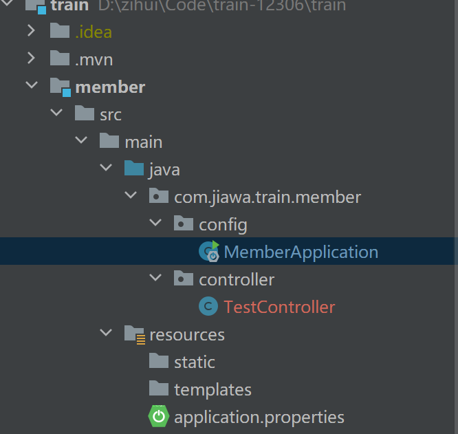
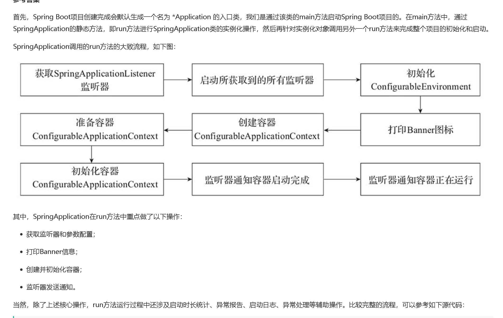

#### 2023/9/6

##### @ComponentScan

当新建一个项目进行分包，当 启动类(Application) 不在跟目录，例如

需要加入 @ComponentScan("com.jiawa") 注解，才能扫描到。

[[Spring注解扫描：ComponentScan使用及原理详解 - 掘金 (juejin.cn)](https://juejin.cn/post/7218023263465160763)]([Spring注解扫描：ComponentScan使用及原理详解 - 掘金 (juejin.cn)](https://juejin.cn/post/7218023263465160763))

##### MyBatis  #{} 和 ${} 的区别是什么？

- `${}`是 Properties 文件中的变量占位符，它可以用于标签属性值和 sql 内部，属于静态文本替换，比如${driver}会被静态替换为`com.mysql.jdbc. Driver`。
- `#{}`是 sql 的参数占位符，MyBatis 会将 sql 中的`#{}`替换为? 号，在 sql 执行前会使用 PreparedStatement 的参数设置方法，按序给 sql 的? 号占位符设置参数值，比如 ps.setInt(0, parameterValue)，`#{item.name}` 的取值方式为使用反射从参数对象中获取 item 对象的 name 属性值，相当于 `param.getItem().getName()`。

##### banner.txt

在 resources 添加 banner.txt 文件，可以改变 Spring 启动图案

##### SpringBoot 启动流程

[https://www.nowcoder.com/issue/tutorial?tutorialId=94&uuid=30b8305b6bde480a85cffedb467f9f9f](https://www.nowcoder.com/issue/tutorial?tutorialId=94&uuid=30b8305b6bde480a85cffedb467f9f9f)
